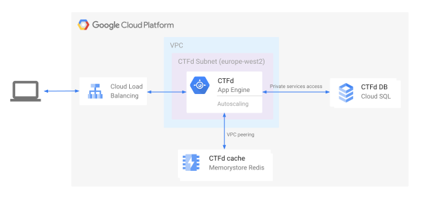

# ctfd-gcp

### Architecture Overview

CTFd is deployed on App Engine Flex, which provides load balancing, auto-scaling, health checks and more right out of the box.

The application resides on a VPC which has a direct peering connection to a Memorystore Redis, allowing us connect CTFd to a cache that, again, requires very little manual maintenance.

There is also a private services access connection to Cloud SQL which is used as the database for CTFd. Again, scaling and other operation are easy.

Furthermore, both the Memorystore and Cloud SQL are assigned only private IP addresses within our VPC, making inaccessible from the internet and enhancing security.

